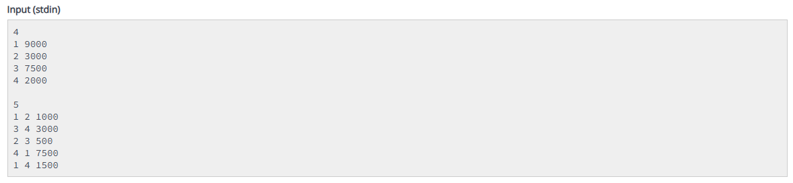
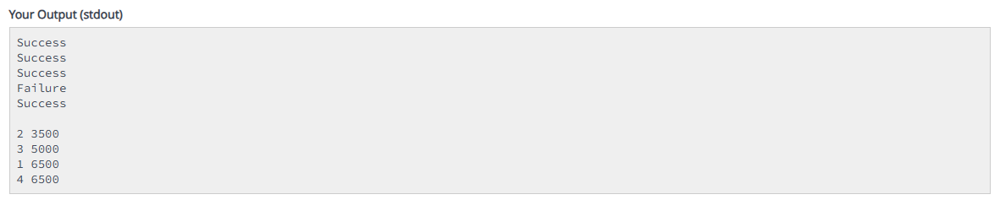

# Digital Wallet System

This C++ program simulates a basic digital wallet system where users can transfer amounts between accounts. It reads account details and transactions, processes them, and then sorts and displays the final balance of each account.

## Description

The program performs the following operations:
1. Reads the number of accounts and their initial balances.
2. Processes a list of transactions to transfer money between accounts.
3. Outputs the result of each transaction.
4. Sorts and displays the final balance of each account in ascending order.

## Files

- Source Code/Main.cpp: The main C++ source file containing the implementation of the digital wallet system.
- Problem-Statement.pdf: The problem statement for the digital wallet system.

## Requirements

- C++11 or later

## Compilation

To compile the program, use the following command:

    g++ -o digital_wallet Source\ Code/Main.cpp

## Execution

To run the compiled program:

    ./digital_wallet

### Input Example

The program reads input in the following format:

1. The number of accounts n.
2. n lines, each containing an account ID and its initial balance.
3. The number of transactions m.
4. m lines, each containing a sender ID, receiver ID, and the amount to be transferred.

**Input Example:**

### Output Example

The program outputs the result of each transaction (Success or Failure), followed by the final balances of each account, sorted by balance.

**Output Example:**

## Problem Statement

For more details about the problem statement, refer to [Problem-Statement.pdf](Problem-Statement.pdf).